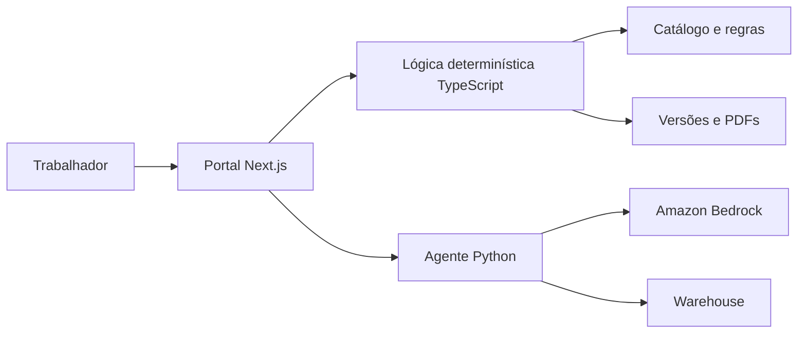
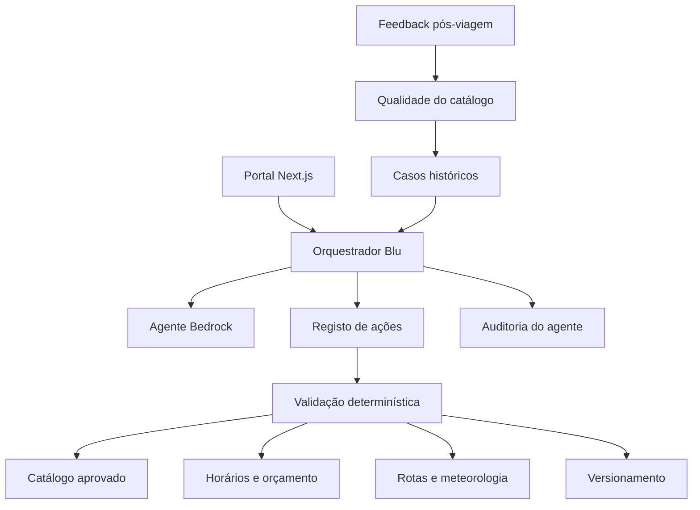

# Blu — Assistente de Curadoria

Não alterei código. A análise abaixo baseia-se no estado atual de `dev`, incluindo o agente Bedrock recentemente integrado.

## Avaliação geral

O projeto já tem uma boa base para o Blu, mas o agente atual ainda funciona sobretudo como **assistente textual**.

Existem atualmente duas camadas:



A lógica TypeScript executa alterações seguras quando reconhece comandos com um formato específico. Se não reconhecer o comando, envia-o ao agente Bedrock, que devolve uma resposta em texto, sem alterar efetivamente o itinerário.

A evolução recomendada é fazer o modelo **propor ações estruturadas** e manter o portal responsável por validá-las, aplicá-las e versioná-las.

---

# 1. O que já existe

## Geração de itinerários

Já está implementado:

- Briefing dividido em etapas.
- Preferências, restrições, orçamento, mobilidade e alimentação.
- Geração com atividades, restaurantes e experiências.
- Aplicação de regras de curadoria.
- Horários propostos e deteção conservadora de conflitos.
- Distribuição por dias.
- Cálculo de preços conhecidos.
- Inclusão de deslocações.
- Persistência numa versão imutável.

A geração principal é determinística e passa por:

- `src/app/api/itineraries/route.ts`
- `src/lib/curation.ts`
- `src/lib/catalog-matching.ts`
- `src/lib/itinerary-scheduling.ts`
- `src/lib/road-routing.ts`

## Edição pelo assistente

O Blu já consegue executar comandos explícitos para:

- Adicionar uma oferta do catálogo.
- Substituir uma atividade.
- Reagendar.
- Reorganizar um dia.
- Remover.
- Criar períodos livres.
- Transformar um dia em dia livre.
- Ajustar a capacidade diária.
- Otimizar a sequência geográfica.

Também já protege atividades bloqueadas ou confirmadas e impede alterações incompatíveis com orçamento, horários, exclusões e regras.

A lógica está principalmente em:

- `src/lib/assistant-editing.ts`
- `src/app/api/assistant/route.ts`
- `src/hooks/useWorkspace.ts`

## Matching do catálogo

Já existe um perfil estruturado que permite associar registos a:

- Interesses.
- Nível Soft, Classic ou Signature.
- Ritmo.
- Horário de início.
- Alimentação.
- Mobilidade.
- Esforço físico.
- Idades.
- Capacidade do grupo.
- Orçamento.
- Preferência de acompanhamento.

Apenas itens aprovados devem entrar na geração determinística.

## Persistência e versionamento

Já existe:

- Histórico imutável de versões.
- Deteção de conflitos de edição.
- Hash do snapshot e cadeia de versões.
- PDFs e variantes linguísticas associados à versão.
- Preservação de propostas antigas após alterações no catálogo.
- Histórico de revisões do catálogo.
- Estados Rascunho, Em revisão, Aprovado e Inativo.

## Integrações existentes

- Open-Meteo para meteorologia.
- OSRM para rotas.
- Amazon Bedrock através de LangChain/LangGraph.
- Tradução local.
- Exportação PDF.
- Partilha por ligação ou documento.

---

# 2. O que está incompleto

## O agente não executa linguagem natural livre

O endpoint do portal segue atualmente esta ordem:

1. Tenta interpretar o texto com expressões regulares.
2. Se reconhecer o comando, altera o itinerário.
3. Se não reconhecer, chama o agente Bedrock.
4. O Bedrock devolve apenas uma resposta textual com `changed: false`.

Isto significa que o Blu pode explicar uma alteração sem conseguir aplicá-la.

## O agente e o portal usam regras diferentes

A implementação Python volta a implementar:

- Pesquisa no catálogo.
- Restrições de mobilidade.
- Alimentação.
- Limites de esforço.
- Meteorologia.

Essa lógica já existe de forma mais completa no portal. A duplicação pode produzir situações em que:

- O agente recomenda uma opção.
- O portal considera-a incompatível.
- O agente consulta dados não publicados.
- Uma alteração futura é aplicada apenas numa das implementações.

A ferramenta Python de catálogo também não demonstra o mesmo controlo de estado de aprovação usado pelo portal.

## A geração do agente não está ligada ao fluxo principal

Existe `/api/agent/curate`, mas:

- O formulário chama a geração determinística do Next.js.
- A resposta do agente é principalmente textual.
- O schema `AgentCuratorResponse` não é imposto à saída do modelo.
- O itinerário do agente não passa obrigatoriamente pelas validações completas do portal.

## Persistência das conversas é limitada

As mensagens do assistente ficam na viagem guardada em `localStorage`, mas não fazem parte do snapshot persistido no histórico de versões.

O snapshot guarda:

- Briefing.
- Itinerário.
- Pendências.

Não guarda de forma estruturada:

- Pedido enviado ao Blu.
- Ação proposta.
- Ação aceite ou rejeitada.
- Justificação.
- Modelo utilizado.
- Regras verificadas.
- Resultado da execução.

## Serviço Bedrock em AWS

A configuração atual apenas tenta usar Bedrock quando encontra `AWS_ACCESS_KEY_ID` e `AWS_SECRET_ACCESS_KEY`.

Num deployment AWS, o recomendado é usar uma IAM Role e a cadeia normal de credenciais do SDK. Com a implementação atual, uma máquina com IAM Role mas sem chaves explícitas pode acabar por usar o modelo falso de desenvolvimento.

## Segurança

Foram identificados estes pontos:

- CORS do agente permite qualquer origem.
- O pedido completo e dados do cliente podem ser enviados ao modelo.
- O input do utilizador é escrito nos logs.
- Não existe autenticação entre o portal e o serviço Python.
- Textos livres do catálogo podem conter conteúdo interpretável como instruções.
- O agente pode expor blocos de raciocínio interno.
- Não existe registo formal de consentimento, operador ou finalidade da ação.

## Testes do agente

A lógica determinística tem boa cobertura, mas o agente Python não tem uma suite automatizada equivalente.

O notebook existente avalia algumas personas, mas não substitui testes para:

- Grounding.
- Ações inválidas.
- Prompt injection.
- Itens inativos.
- Alucinações de catálogo.
- Preservação de atividades confirmadas.
- Custos e latência.
- Indisponibilidade do Bedrock.
- Reprodutibilidade.

---

# 3. O que falta desenvolver

## Feedback pós-viagem

Não existe atualmente um modelo de feedback individual por atividade.

Será necessário guardar:

- Viagem e versão efetivamente realizadas.
- Identificador estável do item do catálogo.
- Revisão do catálogo usada.
- Estado: realizada, cancelada, substituída ou não aplicável.
- Avaliação geral.
- Qualidade da experiência.
- Exatidão da descrição.
- Qualidade do fornecedor.
- Adequação do horário e duração.
- Relação qualidade/preço.
- Acessibilidade.
- Cumprimento de restrições alimentares.
- Comentário do trabalhador.
- Data e autor da avaliação.

O questionário deve exigir uma resposta para cada card, mas permitir “Não aplicável” quando a atividade não se realizou.

## Qualidade do catálogo

É necessário criar agregados por item:

- Número de utilizações.
- Número de avaliações.
- Média e distribuição.
- Taxa de cancelamento.
- Taxa de substituição.
- Problemas recorrentes.
- Tendência nos últimos 30, 90 e 180 dias.
- Data da última utilização.
- Estado do alerta.

Um alerta não deve desativar automaticamente o item. O trabalhador deverá poder:

1. Consultar as avaliações.
2. Rever o registo.
3. Manter ativo.
4. Colocar em revisão.
5. Inativar.

A inativação deve impedir novas recomendações e preservar todo o histórico.

## Knowledge Base histórica

Existem itinerários e PDFs históricos, mas não existe uma camada operacional que os transforme em casos reutilizáveis.

A primeira versão não precisa de uma base vetorial. Pode usar:

- Campos estruturados do briefing.
- Destino.
- Datas e duração.
- Tipo de grupo.
- Interesses.
- Restrições.
- Nível da proposta.
- Itens selecionados.
- Alterações do trabalhador.
- Feedback final.
- Resultado das recomendações anteriores.

Uma pesquisa por similaridade estruturada e texto integral em SQLite/PostgreSQL será mais simples, barata e explicável.

Embeddings devem ser adicionados apenas se os testes mostrarem que a pesquisa estruturada não é suficiente.

---

# 4. Arquitetura recomendada



## Princípio central

O modelo não deve alterar diretamente:

- Itinerários.
- Catálogo.
- Confirmações.
- Versões.
- Estado de aprovação.
- Lixo.

O agente deve devolver ações estruturadas, por exemplo:

```json
{
  "summary": "Substituir a atividade da tarde por uma opção coberta.",
  "actions": [
    {
      "type": "replace_item",
      "dayNumber": 2,
      "itemId": "catalog:item-123",
      "replacementCatalogId": "catalog:item-456"
    }
  ],
  "evidence": [
    "Previsão de chuva",
    "Compatível com mobilidade",
    "Dentro do orçamento"
  ],
  "warnings": [],
  "requiresConfirmation": true
}
```

Depois:

1. O Next.js valida o schema.
2. Resolve os identificadores.
3. Executa a lógica determinística existente.
4. Mostra uma pré-visualização.
5. O trabalhador aceita ou rejeita.
6. A alteração aceite cria uma versão.
7. A decisão fica registada para aprendizagem futura.

## Registo de ações

Criaria inicialmente estas ações:

- `add_catalog_item`
- `replace_item`
- `remove_item`
- `reschedule_item`
- `move_item`
- `reorder_day`
- `set_day_capacity`
- `add_free_period`
- `optimize_route`
- `update_brief`
- `update_pending_confirmation`
- `suggest_alternatives`

As ações destrutivas, alterações a itens confirmados e alterações ao catálogo exigem sempre confirmação humana.

## Fonte única de regras

A lógica TypeScript deve continuar a ser a autoridade para:

- Elegibilidade.
- Horários.
- Preços.
- Orçamento.
- Mobilidade.
- Alimentação.
- Estados do catálogo.
- Proteções.
- Versionamento.

O Python deve consultar essa lógica através de APIs ou receber candidatos já validados. Não deve manter uma segunda implementação independente das regras.

---

# 5. Modelo de dados recomendado

## Auditoria do agente

Nova tabela `agent_runs`:

- `id`
- `trip_id`
- `base_version`
- `user_id`
- `instruction`
- `model_provider`
- `model_id`
- `created_at`
- `completed_at`
- `status`
- `latency_ms`
- `input_hash`
- `error_code`

Nova tabela `agent_actions`:

- `run_id`
- `sequence`
- `action_type`
- `arguments`
- `validation_result`
- `explanation`
- `accepted_at`
- `rejected_at`
- `executed_version`
- `rejection_reason`

## Feedback

Nova tabela `trip_feedback`:

- `id`
- `trip_id`
- `version`
- `completed_by`
- `completed_at`
- `overall_notes`

Nova tabela `item_feedback`:

- `trip_feedback_id`
- `itinerary_item_id`
- `catalog_id`
- `catalog_revision`
- `outcome`
- `overall_rating`
- `accuracy_rating`
- `supplier_rating`
- `schedule_rating`
- `value_rating`
- `accessibility_rating`
- `dietary_rating`
- `issue_tags`
- `comment`

Nova tabela `catalog_quality_alerts`:

- `catalog_id`
- `alert_type`
- `severity`
- `evidence`
- `created_at`
- `resolved_at`
- `resolved_by`
- `resolution`

## Casos históricos

Nova tabela `historical_cases` ou uma vista materializada com:

- Briefing normalizado.
- Snapshot final.
- Itens utilizados.
- Alterações aceites e rejeitadas.
- Feedback.
- Resultado por item.
- Qualidade global.

Os dados históricos devem referenciar identificadores estáveis, nunca apenas nomes.

---

# 6. Funcionalidades adicionais de IA

## Prioridade alta

### Verificação preventiva da proposta

Antes de exportar:

- Detetar sobreposições.
- Identificar horários não confirmados.
- Verificar preços desconhecidos.
- Detetar atividades incompatíveis.
- Sinalizar dias demasiado preenchidos.
- Confirmar que todas as deslocações são possíveis.

### Recomendações proativas

O Blu pode apresentar sugestões sem alterar:

- Alternativa para chuva.
- Alternativa acessível.
- Alternativa dentro do orçamento.
- Substituição de um item com avaliações negativas.
- Atividade próxima para reduzir deslocações.
- Restaurante compatível com a dieta.

### Explicabilidade

Cada recomendação deve mostrar:

- Preferências correspondentes.
- Regras aplicadas.
- Dados usados.
- Alertas.
- Informação desconhecida.
- Razão para rejeitar alternativas.

### Qualidade do briefing

Antes de gerar, o agente pode identificar:

- Respostas contraditórias.
- Campos importantes em falta.
- Orçamento incompatível com o nível pretendido.
- Mobilidade que exige esclarecimento.
- Restrições alimentares sem detalhe suficiente.

## Prioridade média

### Gestão de perturbações

- Chuva.
- Encerramento inesperado.
- Atraso no voo.
- Cancelamento de fornecedor.
- Alteração de horário.

O Blu deve propor um plano alternativo e mostrar o impacto antes da aplicação.

### Análise das decisões dos trabalhadores

Registar:

- Recomendações aceites.
- Recomendações rejeitadas.
- Alterações manuais posteriores.
- Itens frequentemente substituídos.
- Motivos de rejeição.

Isto permite ajustar o ranking sem treinar diretamente o modelo com dados não revistos.

### Qualidade de conteúdo

- Detetar descrições desatualizadas.
- Identificar duplicados no catálogo.
- Sugerir campos em falta.
- Verificar consistência entre idiomas.
- Detetar texto pouco adequado a uma proposta para cliente.

## Prioridade posterior

- Previsão de probabilidade de aceitação de uma proposta.
- Estimativa de risco operacional.
- Previsão de duração real.
- Otimização multiobjetivo entre satisfação, custo e deslocação.

Estas funcionalidades exigem dados de resultado suficientes e não devem ser implementadas antes do feedback estruturado.

---

# 7. Plano por fases

## Fase 0 — Contratos, segurança e avaliação

**Prioridade crítica**

- Definir ações estruturadas do agente.
- Definir quais exigem confirmação humana.
- Criar schemas comuns entre TypeScript e Python.
- Corrigir Bedrock para usar IAM Role.
- Restringir CORS.
- Remover dados pessoais e instruções dos logs.
- Impedir que conteúdo do catálogo seja tratado como instrução.
- Não expor raciocínio interno do modelo.
- Criar conjunto de testes e personas.
- Medir grounding, validade, latência e custo.

Esta fase é dependência de todas as restantes.

## Fase 1 — Blu como editor transacional

**Prioridade crítica**

- Criar endpoint de planeamento de ações.
- Fazer o Bedrock devolver ações estruturadas.
- Validar cada ação no Next.js.
- Apresentar pré-visualização antes/depois.
- Permitir aceitar ou rejeitar.
- Executar usando a lógica existente.
- Permitir comandos compostos, como aliviar um dia, preservar reservas confirmadas e reduzir o custo numa única operação.
- Adaptar a assistência à página aberta: briefing, catálogo, itinerário, confirmações ou exportação.
- Apoiar o preenchimento das confirmações, referências, preços e evidências ainda em falta.
- Disponibilizar um modo de simulação que calcule o impacto sem guardar imediatamente.
- Criar uma versão após aceitação.
- Resumir as alterações entre versões, incluindo atividades, horários, preços e orçamento.
- Registar pedido, ação, validação e decisão.

Resultado: o Blu passa a executar linguagem natural sem contornar regras.

## Fase 2 — Geração e matching assistidos

**Prioridade alta**

- Manter a geração determinística como base.
- Pedir ao agente para ordenar candidatos elegíveis.
- Recuperar casos históricos semelhantes.
- Mostrar razões do ranking.
- Explicar que respostas do briefing e regras de curadoria sustentam cada recomendação.
- Diagnosticar conflitos de horário, deslocações inviáveis, excesso de atividades, orçamento ultrapassado e informação em falta.
- Propor alternativas elegíveis quando uma atividade estiver fechada, exceder o orçamento ou contrariar restrições.
- Comparar a proposta do agente com a proposta base.
- Nunca permitir que o modelo introduza um item inexistente ou inativo.
- Guardar a origem de cada recomendação.

## Fase 3 — Feedback pós-viagem

**Prioridade alta**

- Criar estado “Viagem concluída — feedback pendente”.
- Apresentar questionário card a card.
- Tornar obrigatória uma resposta ou “Não aplicável”.
- Guardar avaliações ligadas à versão e revisão do catálogo.
- Criar página de histórico de avaliações.
- Calcular tendências e alertas.
- Detetar registos incompletos, duplicados, desatualizados ou com avaliações negativas.
- Propor correções do catálogo para aprovação humana.
- Permitir ao trabalhador colocar o item em revisão ou inativá-lo.
- Preservar todas as avaliações após inativação.

## Fase 4 — Knowledge Base histórica

**Prioridade média**

- Indexar snapshots finais.
- Indexar alterações e decisões do trabalhador.
- Associar feedback.
- Criar pesquisa por casos semelhantes.
- Reutilizar estruturas de propostas bem avaliadas sem copiar dados pessoais dos clientes.
- Usar filtros estruturados e pesquisa textual.
- Avaliar ganhos antes de adicionar embeddings.
- Excluir casos sem qualidade mínima ou sem resultado conhecido.

## Fase 5 — Integrações e proatividade

**Prioridade média**

- Unificar meteorologia e rotas como adaptadores do portal.
- Acrescentar cache, timeout e provenance.
- Criar alertas de chuva, encerramento e conflito.
- Apresentar indicadores proativos, incluindo reservas sem confirmação, desvio do orçamento e atividades exteriores afetadas pela meteorologia.
- Permitir regeneração parcial de um dia.
- Calcular deslocações e reorganizar o dia perante alterações meteorológicas, atrasos ou indisponibilidades.
- Integrar voos quando existir uma API escolhida.
- Preparar fornecedores, mapas ou reservas sem confirmar automaticamente.
- Preparar o email de partilha e um resumo da proposta no idioma do cliente, sempre sujeitos a revisão.

## Fase 6 — Operação e melhoria contínua

- Dashboard de desempenho do Blu.
- Taxa de aceitação das sugestões.
- Motivos de rejeição.
- Frequência de correções manuais.
- Executar um controlo de qualidade antes da exportação, cobrindo conteúdo, idiomas, preços, reservas e campos pendentes.
- Custos e latência.
- Testes periódicos contra regressão e prompt injection.
- Comparação controlada de modelos.
- Aprovação humana antes de alterar prompts ou rankings.

---

# 8. Ficheiros a alterar

## Portal existente

- `dmc-workspace/src/app/api/assistant/route.ts`
  - Orquestração, validação e execução das ações.

- `dmc-workspace/src/components/AIAssistantPanel.tsx`
  - Pré-visualização, explicações, aceitar e rejeitar.

- `dmc-workspace/src/hooks/useWorkspace.ts`
  - Aplicação, persistência e versionamento das ações.

- `dmc-workspace/src/lib/assistant-editing.ts`
  - Extrair comandos para um registo de ações reutilizável.

- `dmc-workspace/src/lib/catalog-matching.ts`
  - Ranking explicável e sinais históricos.

- `dmc-workspace/src/lib/curation.ts`
  - Geração base e integração do ranking.

- `dmc-workspace/src/lib/snapshot-validation.ts`
  - Metadados do agente e feedback, quando aplicável.

- `dmc-workspace/src/lib/version-store.ts`
  - Auditoria, feedback e ligação às versões.

- `dmc-workspace/src/lib/catalog-store.ts`
  - Alertas de qualidade e histórico de avaliações.

- `dmc-workspace/src/types/index.ts`
  - Contratos das ações, recomendações e feedback.

- `dmc-workspace/src/app/catalog/page.tsx`
  - Qualidade, tendências, alertas e decisão de inativação.

- `dmc-workspace/src/components/ActivityCard.tsx`
  - Estado do feedback e explicação da recomendação.

- `dmc-workspace/src/lib/activity-confirmation.ts`
  - Apoio do agente aos dados e evidências ainda em falta.

- `dmc-workspace/src/lib/proposal-budget.ts` e `dmc-workspace/src/lib/itinerary-pdf.ts`
  - Diagnóstico de preços, controlo de qualidade e validação antes da exportação.

- `dmc-workspace/src/app/api/shares/route.ts`
  - Preparação assistida e supervisionada da comunicação com o cliente.

## Novos módulos recomendados

- `src/lib/assistant-actions.ts`
- `src/lib/assistant-policy.ts`
- `src/lib/agent-audit-store.ts`
- `src/lib/feedback-store.ts`
- `src/lib/catalog-quality.ts`
- `src/lib/historical-cases.ts`
- `src/lib/proposal-diagnostics.ts`
- `src/lib/export-quality.ts`
- `src/components/AssistantActionPreview.tsx`
- `src/components/AssistantDiagnostics.tsx`
- `src/components/PostTripFeedback.tsx`
- `src/app/feedback/[tripId]/page.tsx`
- `src/app/api/feedback/route.ts`
- `src/app/api/catalog/quality/route.ts`

## Serviço Python

- `src/blu_ai/api/server.py`
  - Endpoints autenticados e contratos estruturados.

- `src/blu_ai/agents/curator_agent.py`
  - Planeamento de ações em vez de respostas livres.

- `src/blu_ai/agents/prompts.py`
  - Separação entre dados, regras e instruções.

- `src/blu_ai/schemas/itinerary.py`
  - Schemas de planos e ações.

- `src/blu_ai/tools/catalog_tools.py`
  - Deixar de pesquisar diretamente dados sem passar pela autoridade do portal.

- `src/blu_ai/tools/constraint_tools.py`
  - Remover duplicação ou transformar numa chamada à validação central.

- `src/blu_ai/config.py` e `src/blu_ai/llm.py`
  - IAM Role, configuração segura e falha explícita.

## Testes

- Testes dos schemas de ação.
- Testes de autorização e confirmação.
- Testes de grounding.
- Testes de prompt injection.
- Testes de itens inativos.
- Testes de feedback completo.
- Testes de alertas e tendências.
- Testes de preservação histórica.
- Testes de diagnóstico, alternativas e comandos compostos.
- Testes do modo de simulação e do resumo entre versões.
- Testes de controlo de qualidade antes da exportação.
- Testes da preparação de comunicações sem envio automático.
- Testes do fallback quando Bedrock está indisponível.
- Testes ponta a ponta: pedido → proposta → aprovação → versão.

---

# 9. Decisões recomendadas

1. **Manter a lógica de negócio no Next.js/TypeScript.**
2. **Usar o Bedrock para interpretar, planear, explicar e ordenar.**
3. **Nunca permitir escrita direta do agente na base de dados.**
4. **Exigir aprovação humana para alterações críticas.**
5. **Começar a Knowledge Base com SQL e pesquisa textual.**
6. **Adicionar embeddings apenas depois de medir necessidade.**
7. **Não realizar aprendizagem automática antes de existir feedback estruturado.**
8. **Usar as decisões dos trabalhadores como sinal auditável, sem autoajuste invisível.**
9. **Migrar a persistência para uma base central antes de utilização multiutilizador em produção.**
10. **Manter itinerários e PDFs históricos imutáveis.**

A primeira entrega deve abranger as **Fases 0 e 1**. Isso transforma o Blu num agente realmente útil sem comprometer catálogo, confirmações, versões ou supervisão humana. Todas as fases seguintes fazem parte do âmbito de implementação aprovado neste plano e devem manter a pré-visualização e a confirmação do trabalhador antes de alterar itinerários, catálogo, preços ou estados.
